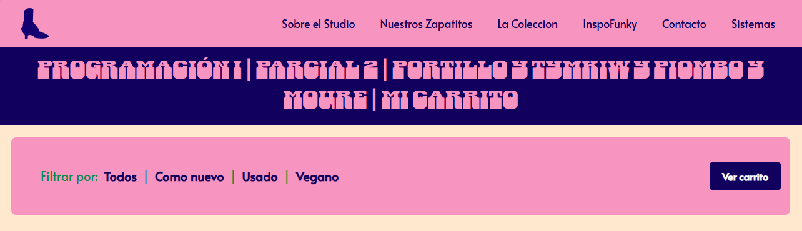

# Funky Studio - Carrito de Compras

Este proyecto es una aplicación web de comercio electrónico (front-end) desarrollada como parte del segundo parcial de la materia Programación I (Autores: Portillo, Tymkiw, Piombo, Moure).

El sitio simula una tienda de calzado llamada Funky Studio, permitiendo a los usuarios explorar un catálogo de zapatos, filtrar por categorías y gestionar un carrito de compras dinámico.

## Funcionalidades Principales

El proyecto destaca por su fuerte uso de manipulación del DOM mediante JavaScript Vanilla, incluyendo:

- Catálogo Dinámico: Los productos se renderizan en la página directamente desde un array de objetos en JavaScript.

- Filtros de Búsqueda: Permite visualizar productos según su condición mediante botones de filtrado (Todos, Como nuevo, Usado, Vegano).

- Gestión del Carrito:

    1. Agregar productos al carrito.

    2. Visualizar la cantidad total de ítems y el monto acumulado en un indicador flotante siempre visible.

    3. Aumentar la cantidad si el producto ya existe en el carrito.

    4. Eliminar unidades específicas o vaciar el carrito por completo.

- Modales 100% Dinámicos: Tanto el detalle individual de cada producto como la vista extendida del carrito se generan creando elementos HTML sobre la marcha (DOM Scripting) sin depender de librerías externas para su funcionamiento.

## Tecnologías y Herramientas

- HTML5: Estructura semántica del sitio.

- CSS3: Estilos personalizados, uso de variables nativas (Custom Properties), CSS Grid y Flexbox.

- JavaScript (ES6): Toda la lógica de negocio, manipulación del DOM, eventos y manejo de arrays/objetos.

- Bootstrap 5: Utilizado para la barra de navegación (Navbar) y el sistema de grillas básico.

- Google Fonts: Fuentes tipográficas personalizadas (Alata, Danfo, Darumadrop One).

## Estructura del Proyecto

`index.html:` Estructura principal del documento y punto de entrada.

`estilo.css:` Hoja de estilos principal.

`parcial.js:` Archivo con toda la lógica del catálogo, filtros y carrito.

`package.json / package-lock.json:` Gestión de dependencias (Bootstrap).

`img/:` Carpeta de recursos gráficos (imágenes de zapatos, logos, hero, etc.).

## Instalación y Uso

1. Descarga o clona el repositorio en tu computadora.

2. Si deseas instalar las dependencias locales, ejecuta npm install en la terminal (aunque Bootstrap también está enlazado vía CDN).

3. Abre el archivo index.html en tu navegador web de preferencia.

> Recomendación: Puedes usar la extensión "Live Server" de VS Code para una mejor experiencia de desarrollo.